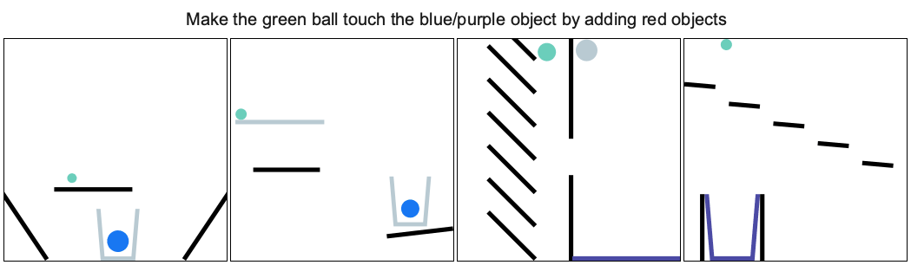

<p align="center"></p>

[](LICENSE)
[](https://circleci.com/gh/facebookresearch/phyre)

**PHYRE** is a benchmark for physical reasoning.

It provides a set of physics puzzles in a simulated 2D world. Each puzzle
has a goal state (e.g., *make the green ball touch the blue wall*) and an
initial state in which the goal is not satisfied (see the figure below). A
puzzle can be solved by placing one or more new bodies in the environment
such that when the physical simulation is run the goal is satisfied. An agent
playing this game must solve previously unseen puzzles in as few attempts as
possible.



# How to use the PHYRE

Phyre framework could be used for several tasks related to physical reasoning.

  * As a benchmark: Phyre allows to evaluate different reasoning agents on a predefined set of tasks and complexity tiers. You can explore the tasks and try to solve them using the [demo](http://player.phyre.ai/).
  * As a task building platform: Phyre contains a framework to create new levels with goals and objects from a way richer set that one used in the standard tiers. This could be used to study specific types of generalization for reasoning agents, performance or forward modelling, or something else, e.g., enable [reasoning about physics in natural language](https://arxiv.org/abs/2005.00730). See [this doc](docs/CREATOR.md) for details.
  * As an interface to a fast physical engine: Phyre uses [Box2d](https://box2d.org/) engine under the hood. In the benchmark we hide all details of the simulation. See [this doc](docs/SIMULATOR.md) for details on low level interface.

# Getting started

## Installation
The simplest way to install PHYRE is via pip. As PHYRE requires Python version 3.6, we recommend installing PHYRE inside a virtual environment, e.g. using [Conda](https://docs.conda.io/en/latest/).

 We provide PHYRE as a pip package for both Linux and Mac OS.

```(bash)
conda create -n phyre python=3.6 && conda activate phyre
pip install phyre
```

 To check that the installation was successful, run `python -m phyre.server` and open http://localhost:30303. That should start a local demo server.

For instructions on building PHYRE from source and installing in a Docker container, see [INSTALLATION](INSTALLATION.md).

## Notebooks
We provide jupyter notebooks that show [how to use PHYRE API](examples/01_phyre_intro.ipynb) ([open in Colab](https://colab.research.google.com/github/facebookresearch/phyre/blob/master/examples/01_phyre_intro.ipynb)) to run simulations and evaluate a random agent and [how to use simulation cache](examples/02_memoized_agent.ipynb) ([open in Colab](https://colab.research.google.com/github/facebookresearch/phyre/blob/master/examples/02_memoized_agent.ipynb)) to train agents faster.

## Training an agent
We provide a set of baseline agents that are described in the paper.
In order to run them, you need to install additional python dependencies with `pip install -r requirements.agents.txt`.

All the agents are located in `agents/` folder. The entry point is `train.py`
that will train an agent on specified eval setup with a specified fold.
E.g., the following command will train a memoization agent:

```(bash)
python agents/train.py \
    --output-dir=results/ball_cross_template/0 \
    --eval-setup-name=ball_cross_template \
    --fold-id=0 \
    --mem-rerank-size 100 \
    --agent-type=memoize
```

File `run_experiment.py` contains groups of experiments, e.g, sweeping over number of update for DQN-O or training agents on all seeds and eval setups. And `train_all_baseline.sh` starts experiments to train all baseline algorithms in the paper.

# License
PHYRE is released under the Apache license. See [LICENSE](LICENSE) for additional details.


# Citation

If you use PHYRE in your experiments, please cite it:

```bibtex
@article{bakhtin2019phyre,
    title={PHYRE: A New Benchmark for Physical Reasoning},
    author={Anton Bakhtin and Laurens van der Maaten and Justin Johnson and Laura Gustafson and Ross Girshick},
    year={2019},
    journal={arXiv:1908.05656}
}
```

# Related projects

[Solving Physics Puzzles by Reasoning about Paths](https://github.com/ndrwmlnk/PHYRE-Reasoning-about-Paths) is a new deep learning model for goal-driven tasks that require intuitive physical reasoning and intervention in the scene to achieve a desired end goal ([NeurIPS video presentation](https://youtu.be/X30QGeIEXRs);  [arXiv:2011.07357](https://arxiv.org/abs/2011.07357)).

[Virtual Tools](https://k-r-allen.github.io/tool-games/) is a similar project aiming to research the structure necessary to capture human-like reasoning in these sorts of physics puzzles.

[ESPRIT](https://blog.einstein.ai/explaining-solutions-to-physical-reasoning-tasks/) is a framework based on PHYRE that connects physical reasoning and natural language explanations.
