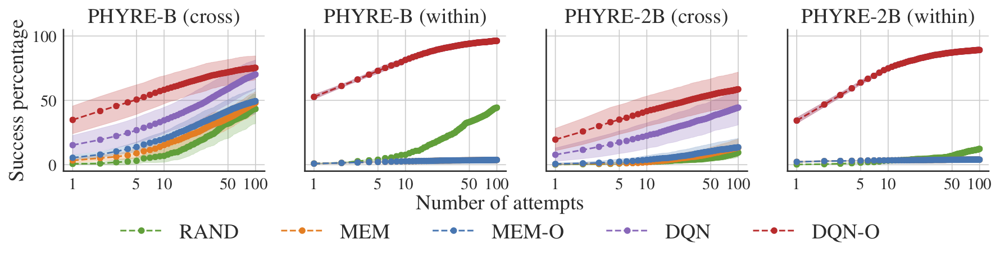

# PHYRE Agents

Contains code to reproduce agent baselines from [PHYRE paper](https://arxiv.org/abs/1908.05656).

## Agents

The above graph shows the mean number of attempts to solve tasks for each agent type across each of the evaluation setups. For full analysis, see the [PHYRE paper](https://arxiv.org/abs/1908.05656).

All agents are trained to predict whether a specific action solves a specific task. We use the default 100k [cache](https://phyre.ai/docs/cache.html) of actions on each of the tasks for training. At evaluation, the agents rank some subset of these actions, and try actions according to their rank. During cross-validation we found that using all 100k actions hurts the performance due to low diversity, and so we lower the number of actions ranked accordingly. The code for this training loop can be found in [`offline_agents.py`](offline_agents.py).

### **Random Agent**
Ranks actions randomly. Corresponds to `RandomAgent` in [`offline_agents.py`](offline_agents.py)

### **Memoization Agent**
Ranks actions according to the percentage of tasks in the training set that the action solves. Corresponds to `MemoizeAgent` in  [`offline_agents.py`](offline_agents.py).

### **Memoization Online Agent**
Same as memoization agent, but makes online updates to the ranking based on whether or not a selected action solves the test task.

Corresponds to `MemoizeAgent` in  [`offline_agents.py`](offline_agents.py) when `--mem-test-simulation-weight` is positive.

###  **DQN Agent**
Trains a neural net to predict whether a given action solves a task (inputed as an image). Training loss is binary cross entropy loss between predicted status (solved/unsolved) and actual status of action on task. Actions are ranked at test time in descending order based on their score.

Corresponds to `DQNAgent` in  [`offline_agents.py`](offline_agents.py). Training loop for DQN is in [`neural_agent.py`](neural_agent.py). Architectures used for DQN is `ResNet18FilmAction` in [`nets.py`](nets.py).

### **DQN Online Agent**
Same as DQN Agent, except makes online updates based on whether or not a selected action solves the test task.

Corresponds to `DQNAgent` in  [`offline_agents.py`](offline_agents.py) when `--dqn-finetune-iterations` is positive. Training loop for DQN is in [`neural_agent.py`](neural_agent.py). Architectures used for DQN is in [`nets.py`](nets.py).

### **Oracle Agent**
Does best possible ranking on the list of actions for each task. Agent solves task in 1 attempt if any action in actions to rank solves the task, otherwise 100.
Corresponds to `OracleRankingAgent` in  [`offline_agents.py`](offline_agents.py).

## Running Experiments
Parameter sweeps/selected hyperparameters for experiments are kept in [`run_experiment.py`](run_experiment.py).

To run a given experiment, with arguments corresponding to `AGENT_ARG_NAME` in [`run_experiment.py`](run_experiment.py), using test tasks according to `USE_TEST_SPLIT` on `SEEDS` different seeds, i.e., train/test splits, run:
```bash
python agents/run_experiment.py \
  --use-test-split <USE_TEST_SPLIT> \
  --arg-generator <AGENT_ARG_NAME> \
  --num-seeds <SEEDS>
```

This command will train `SEED x 2 (num tiers) x 2 (within/cross template)` agents.

To reproduce all baseline experiments in the paper, run:
```bash
./agents/train_all_baseline.sh
```

## Download checkpoints

We provide all 40 checkpoints for DQN model in the final splits. Do download them, run `bash download_dqn_ckps.sh`

## Analyzing Results
Experimental results for each run are stored in `results` subfolder using the following folder structure:

```bash
results/{final,dev}/<AGENT_ARG_NAME>/<EVAL_SETUP>/<SEED>
```

To compare the results of agents, run:

```bash
python agents/compare.py \
  --agent-paths <PATH_TO_AGENT_ARG_NAME1> <PATH_TO_AGENT_ARG_NAME2> ...
```

The above will output the AUCCESS and number of tasks independently solved by 100 attempts for each evaluation setup for each of the agents and run significance tests across all seeds for each evaluation setup on each pair agents.
Here's an output from the script:

```
-----------ball_cross_template----------------
Evaluated on 3 seeds: {'0', '2', '1'}

Path for agent is results/dev/dqn_10k
AUCCESS
        Mean: 0.417
        STD: 0.101
        Is this agent's AUCCESS significantly higher than results/dev/mem_rank_10?
                False, p-value: 0.0544
% Independently solved at 100 attempts
        Mean: 0.651
        STD: 0.067

Path for agent is results/dev/mem_rank_10
AUCCESS
        Mean: 0.086
        STD: 0.039
        Is this agent's AUCCESS significantly higher than results/dev/dqn_10k?
                False, p-value: 0.9456
% Independently solved at 100 attempts
        Mean: 0.122
        STD: 0.056

-----------ball_within_template----------------
...
...
```
